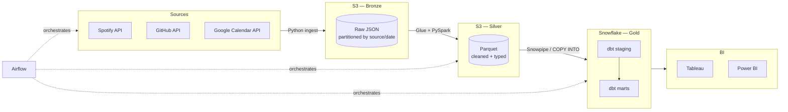

# my-life-in-data

A personal data lakehouse: pull my own data from Spotify, GitHub, and Google Calendar through a medallion architecture, and surface insights about how I actually spend my time.


## Why this exists

Most DE portfolios use the same NYC Taxi or Kaggle datasets. This one uses my own life — which means messy real-world OAuth flows, rate-limited APIs, schema drift between vendor versions, and analytical questions only I care enough to answer well.

## Architecture



## Stack

| Layer            | Tool                              |
| ---------------- | --------------------------------- |
| Ingestion        | Python (requests, OAuth)          |
| Storage (Bronze) | AWS S3                            |
| Transform        | AWS Glue + PySpark → Silver       |
| Warehouse (Gold) | Snowflake                         |
| Modeling         | dbt                               |
| Orchestration    | Apache Airflow (Docker)           |
| Visualization    | Tableau / Power BI                |
| Infrastructure   | Terraform                         |

## What I'll learn from it

> Screenshots and insights go here as data accumulates. Placeholders for now:

- 🎧 Listening trends — top artists / genres by quarter, listening latency from release date
- 💻 Coding velocity — commits / PRs / repo diversity over time
- 📅 Calendar load — meeting hours vs. focus blocks, recurring-meeting decay rate

## Repository layout

```
my-life-in-data/
├── ingestion/          # Python clients for each source API
├── airflow/dags/       # Airflow DAGs orchestrating the pipeline
├── glue/jobs/          # PySpark jobs: Bronze → Silver
├── dbt/                # dbt project: Silver → Gold marts
├── notebooks/          # Exploratory analysis & year-in-review
├── terraform/          # IaC for S3 buckets, IAM, Glue jobs
├── docs/               # Architecture deep-dive
└── docker-compose.yml  # Local Airflow stack
```

## Getting started

### Prerequisites

- Python 3.11+
- Docker + Docker Compose
- AWS account (free tier works) + AWS CLI configured
- Snowflake account ([30-day free trial](https://signup.snowflake.com/))
- API credentials for each source (see `.env.example`)

### Setup

```bash
git clone https://github.com/HarshikaReddyUppula/my-life-in-data.git
cd my-life-in-data

# Python deps
python -m venv .venv && source .venv/bin/activate
pip install -r requirements.txt

# Credentials
cp .env.example .env  # then fill in your keys

# Infrastructure
cd terraform && terraform init && terraform apply

# Local Airflow
docker compose up -d

# dbt
cd dbt && cp profiles.yml.example ~/.dbt/profiles.yml  # then fill in Snowflake creds
dbt deps && dbt seed && dbt run
```

## Roadmap

- [ ] **Ingestion** — Spotify OAuth + recently-played endpoint
- [ ] **Ingestion** — GitHub events via public API
- [ ] **Ingestion** — Google Calendar events
- [ ] **Bronze → Silver** — Glue job for Spotify, schema enforcement, dedup
- [ ] **Snowflake** — Snowpipe auto-ingest from Silver
- [ ] **dbt** — staging models + sources.yml with tests
- [ ] **dbt** — `fct_daily_listening`, `fct_daily_coding`, `dim_artist`
- [ ] **Airflow** — daily DAG: ingest → glue → dbt
- [ ] **Tableau** — Year-in-review dashboard
- [ ] **Quality** — `dbt-expectations` tests on all marts
- [ ] **CI/CD** — GitHub Actions: dbt build + sqlfluff on PR

## License

MIT — go pull your own data.
